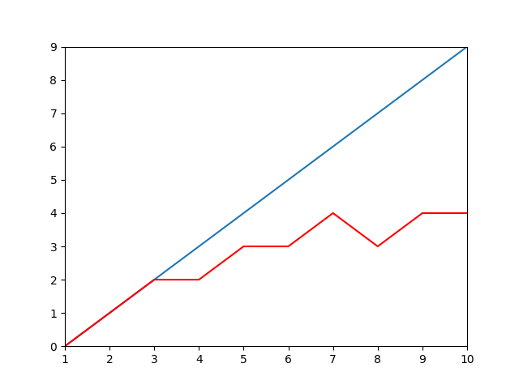
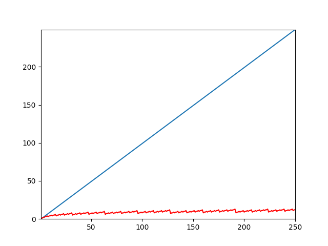
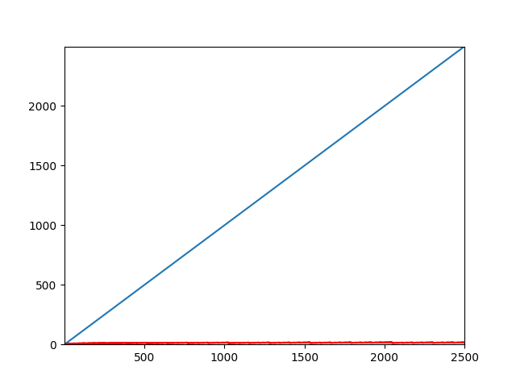

# Square and Multiply

Potenciação de números grandes usando divisao e conquisa com complexidade temporal O(log (n)) e complexidade espacial constante O(1).

# Executando experimento

## Criando venv

`python -m venv venv`

ou

`python3 -m venv venv`

## Ativando venv

| SO | Comando |
| - | - | 
| Linux ou Mac | `source venv/bin/activate` |
| Windows | `.\venv\Scripts\Activate.ps1` | 

## Instalando dependências

`pip install -r requirements`

## Executando

Exemplo que calcula 2¹, 2², 2³, ..., 2¹⁰ printa resultado e mostra grafico comparando quantidade de multiplicacoes feitas para calcular potencia com o algoritmo (em vermelho) e sem o algoritmo (em azul)

`python main.py 2 10`

### Saída:

```plain
2^1 | RESULT: 2 | COUNT: 0
2^2 | RESULT: 4 | COUNT: 1
2^3 | RESULT: 8 | COUNT: 2
2^4 | RESULT: 16 | COUNT: 2
2^5 | RESULT: 32 | COUNT: 3
2^6 | RESULT: 64 | COUNT: 3
2^7 | RESULT: 128 | COUNT: 4
2^8 | RESULT: 256 | COUNT: 3
2^9 | RESULT: 512 | COUNT: 4
2^10 | RESULT: 1024 | COUNT: 4
```



## Demonstração em vídeo

[Vídeo no youtube](https://www.youtube.com/watch?v=LQp3dqet_JI)

## Análise de complexidade
### Complexidade Temporal
Vamos rodar o seguinte experimento para ver a quantidade de multiplicacoes feitas quando realizamos a potenciacao de 2¹ até 2²⁵⁰ utilizando o algoritmo square and multiply

`python main.py 2 250`



Agora vamos executar o experimento de 2¹ a 2²⁵⁰⁰

`python main.py 2 2500`



A curva vermelha indica um crescimento muito lento das multiplicacoes feitas para se obter o resultado em relação ao crescimento do tamanho da entrada. Se assemelhando a uma curva log(n).

A complexidade temporal pode ser inferida como **O(log(n))**.

#### Demonstração matemática

##### Entradas
- n é o expoente da potenciação. Deve ser diferente de 0.
- b é a base da potenciação.

| **Equacao geral** |
|-|
| **b^n = b^(n/2) * b^(n/2) * b^(n mod 2)** |

##### Demonstração

| Passo | Execução |
|-|-|
| 1 | b^n = b^(n/2) * b^(n/2) * b^(n mod 2) |
| 2 | b^(n/2) = b^(n/4) * b^(n/4) * b^(n mod 2) |
| 3 | b^(n/4) = b^(n/8) * b^(n/8) * b^(n mod 2) |
|...| ... |
| log(n) | b^(n/n) = b^(n/2n) * b^(n/2n) * b^(n mod 2) |
|        | b^1 = b^(1/2) * b^(1/2) * b^(n mod 2) |
|        | como queremos demonstrar |

O fator b^(n mod 2) trata os casos onde a divisão do expoente por 2 não é exata.
- Se a divisão for exata, o mod da 0, e o último fator vira b⁰ que é 1, que não muda o resultado da multiplicação.
- Se a divisão não for exata, o mod da 1, e o último fator vira b¹ que é b, complementando a multiplicação como necessário.

A quantidade de passos do algoritmo é aproximadamente log(n) na base 2, onde n é a potência passada na entrada.

log(n) é a quantidade de vezes que a potência tem que ser divida por dois (sempre arredondando o resultado para baixo) até resultar em 1, que é a base da recursão e condição de parada do algoritmo.


> Exemplo 1 - expoente par, com divisores sempre pares
```plain
Resolvendo 2⁸

Aplicando o algoritmo:
2⁸ = 2⁴ * 2⁴
2⁴ = 2² * 2²
2² = 2¹ * 2¹
2¹ = 2

Substituindo:
2² = 2¹ * 2¹ = 2 * 2 = 4
2⁴ = 2² * 2² = 4 * 4 = 16
2⁸ = 2⁴ * 2⁴ = 16 * 16 = 258

2⁸ = 258

Foram feitas 3 multiplicacoes para se chegar ao resultado correto
```

> Exemplo 2 - expoente par, com alguns divisores impares

```plain
Resolvendo 2¹⁰

Aplicando o algoritmo:
2¹⁰ = 2⁵ * 2⁵
2⁵ = 2² * 2² * 2
2² = 2¹ * 2¹
2¹ = 2

Substituindo:
2² = 2¹ * 2¹ = 2 * 2 = 4
2⁵ = 2² * 2² * 2 = 32
2¹⁰ = 2⁵ * 2⁵ = 32 * 32 = 1024

2¹⁰ = 1024 

Foram feitas 4 multiplicacoes para se chegar ao resultado correto
```

### Complexidade Espacial

Em sua versão recursiva, que é a versão desse código, a complexidade espacial é **O(log(n))** devido à pilha de chamadas recursivas, onde n é o expoente da potenciação e b a base que acumula o resultado. Cada chamada recursiva adiciona um novo quadro à pilha, e a profundidade máxima da pilha é log(n).

Em sua versão iterativa, o algoritmo não utiliza espaço adicional de maneira dinâmica, ou seja, não é dependente da entrada. Logo a complexidade espacial é constante **O(1)**.
